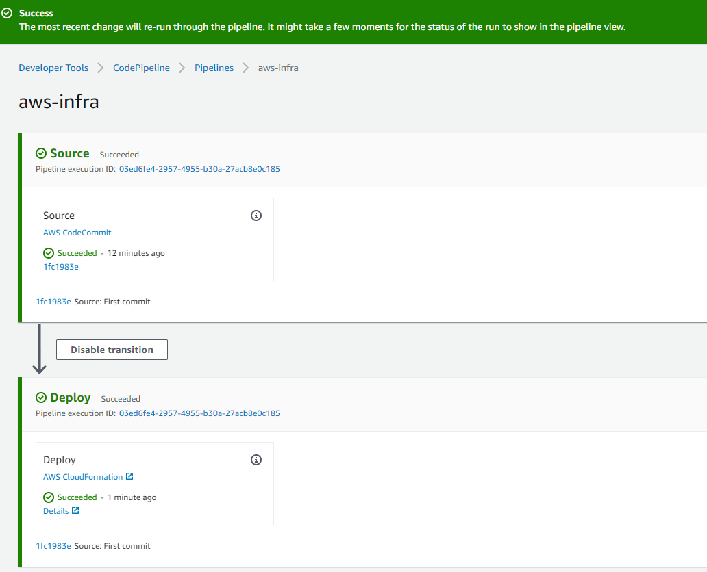

# IaC CI/CD pipeline with AWS CloudFormation, AWS CodePipeline and AWS CodeCommit

**NOT Added to LAB's yet** - just a preview 
In this lab we provide alternate way for [Step 3 in Lab1](/Lab1/README.md#3-create-environment-with-cloudformation-cfn) infra creation as IaC (Infrastructure as a Code) approach using AWS CodeCommit and CodePipeline services as deployment pipeline and source control<br>

> **_NOTE:_** Make sure AWS credentials and default region are exported before running IAM dependant commands - see [Lab1](/Lab1/README.md#export-credentials) for details

## AWS Region
* Only use Oregon 'us-west-2' AWS Region<br>

# Create Execution Role for CloudFormation to be used by CodePipeline

Create trust policy file:
````json
cat <<EoF > trusted-entity.json
{
  "Version": "2012-10-17",
  "Statement": [
    {
      "Sid": "",
      "Effect": "Allow",
      "Principal": {
        "Service": "cloudformation.amazonaws.com"
      },
      "Action": "sts:AssumeRole"
    }
  ]
}
EoF
````
Create policy file:
````json
cat <<EoF > cf-policy.json
{
    "Statement": [
        {
            "Action": [
                "ec2:*",
                "cloudformation:*",
                "s3:*",
                "EKS:*",
                "IAM:*",
                "ssm:GetParameters" 
            ],
            "Resource": "*",
            "Effect": "Allow"
        }
    ],
    "Version": "2012-10-17"
}   
EoF
````

> **_NOTE:_** Above policy is *very* liberal - and not following least privilege. Only for non-prod testing.

Create IAM Role *cf-execution-codedeploy-role*:
````
aws iam create-role --role-name cf-execution-codedeploy-role --assume-role-policy-document file://trusted-entity.json
````

Attach Permissions to role:
````
aws iam put-role-policy --role-name cf-execution-codedeploy-role --policy-name cf-execution-policy --policy-document file://cf-policy.json
````

# Create AWS CodeCommit Repository

1. Create CodeCommit Repository with AWS CLI
    ````bash
    aws codecommit create-repository --repository-name infra-stack
    ````
2. Create README.md file and add it to repository

    Create README.md to repository (file-content is Base64 Encoded):
    ````bash
    aws codecommit put-file --repository-name infra-stack --branch-name main --file-content QVdTIENvZGVQaXBlbGluZSBzb3VyY2Ugd2l0aCBhd3MtaW1tZXJzaW9uLWluZnJhLnlhbWwgc3RhY2sgYW5kIGltbWVyc2lvbi1pbmZyYS5qc29uIHBhcmFtZXRlciBmaWxlLgo= --file-path README.md --commit-message "Added README.md"
    ````
    >TIP: Validate repository and contents on AWS Console CodeCommit Service.

3. Install and configure AWS CLI Credential helper <br>

    Configure project and clone project to your workstation see [THIS](https://docs.aws.amazon.com/codecommit/latest/userguide/setting-up.html?icmpid=docs_acc_console_connect_np#setting-up-compat) for additional information.

    After Credential helper is installed and configured clone the repository you just made:
   
    ````bash
    # This works if credential helper is correctly configured
    git clone https://git-codecommit.us-west-2.amazonaws.com/v1/repos/infra-stack
    ````

# Create CodePipeline

1. Open CodePipeline service and "Create pipeline" - see picture below for additional details<br>

    Pipeline name: **aws-infra**<br>
    New Service **role**<br>
    Expand "*Advanced settings*" Custom location -> Use S3 bucket created in Lab1 as *Custom location*<br>
    Leave default KMS<br>

     

Select "Next"

2. Add Source Stage - fill in details as below picture

    Source Provider: **AWS CodeCommit** <br>
    Repository name: **infra-stack** <br>
    Branch Name: **main**<br>
    Leave other as defaults<br>
    

Select "Next"

3. Skip Build Stake
    Select: **Skip Build Stage**<br>
    

4. Add deploy Stage - see picture below for additional details<br>

    Provider: **AWS CloudFormation**<br>
    Region: **US West(Oregon)**<br>
    Action mode: **Create or update stack**<br>
    Stack name: **AWS-Infra**<br>
    Template: **aws-immersion-infra.yaml**<br>
    Toggle "Use Configuration File" and use: **immersion-infra.json**<br>
    Capabilities: **CAPABILITY_NAMED_IAM**<br>
    Role: **cf-execution-codedeploy-role**<br>
    

Select "Next" <br>

5. Validate changes and "Create pipeline"

> **_NOTE:_** As there is not yet source artifacts (stack or parameter file) the first pipeline Deploy execution will fail


## Commit configuration files to CodeCommit

To fix pipeline **copy** below two files to your cloned repository's root folder - from **CICD-for-Infra/template/** folder of this github.<br>
- **aws-immersion-infra.yaml**<br>
- **infra-parameters.yaml**<br>

Check parameters in infra-parameters.yaml modify those as desired (no need to modify) and push to codecommit to trigger the pipeline.

````
git add .
````

````
git commit -m "First commit"
````

````
git push
````

This re-triggers pipeline and see it execute the infra - validate this in AWS CodePipeline console and also AWS CloudFormation.



Return back to Lab1 - and continue from [Chapter 4](/Lab1/README.md#4-login-to-bastion-host---after-stack-is-executed)
