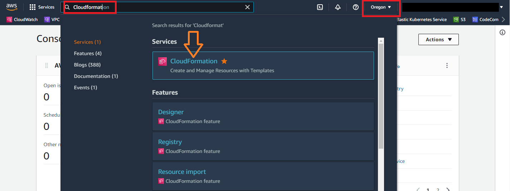
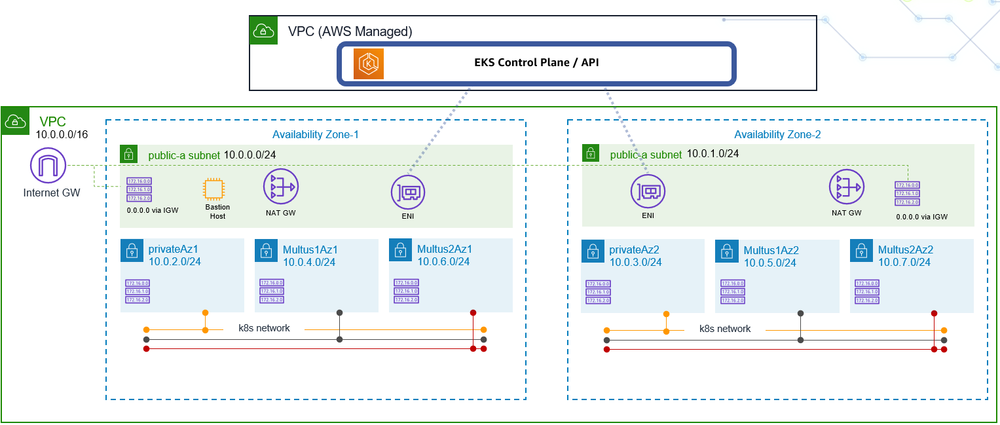

# Lab1: EKS for CNF (Containerized Network Functions) engineer - AWS environment creation

### AWS Region
* Only use Oregon 'us-west-2' AWS Region. (See console screenshot below)
* As of today (28 March 2022) EKS cluster is created with Kubernetes 1.21. 

## 1. Please download/extract CFN templates for this lab accessible locally
> **_NOTE:_** To download these from GitHub at once, please select "Code" on the top left corner of main-page menu, and then click green "Code" and then select "Download Zip" file

* CFN repo1: https://github.com/TheHannuAWS/AWS-Immersion-Day/blob/main/Lab1/template/aws-immersion-infra.yaml
    * This template creates VPC, public/private subnets, subnet route tables, IGW, NAT-GW, Security Groups, EKS Cluster and Bastion Host
* CFN repo2: https://github.com/TheHannuAWS/AWS-Immersion-Day/blob/main/Lab1/template/amazon-eks-nodegroup-multus.yaml
    * This creates Autoscaling group to be used for worker node group of your EKS cluster. This also creates Lambda function for multus-ready worker node group.
* Lambda Function Zip: https://github.com/TheHannuAWS/AWS-Immersion-Day/blob/main/Lab1/template/lambda_function.zip
    * Lambda function to be used along with CFN repo2 (worker node group stack).

## 2. Log in to AWS Console 
> **_NOTE:_** please select "Oregon" AWS Region



## 3. Create Environment with CloudFormation (CFN)
* Type "CloudFormation" at search service section and open AWS CloudFormation service.  Tip: Use right mouse button - Open in New tab when opening
* In CFN select *Create stack* - *With new resources(standard)*
* Click *Template is ready* (default), "Upload a template file", "Choose file" Select "aws-immersion-infra.yaml" file that you have downloaded from GitHub under Lab1 
* Click "Next"
* Update following parameters (keep default values for others)
    * Stack name: AWS-Infra
    * AvailabilityZones: Choose "us-west-2a" and "us-west-2b"
    * BastionKeyPairName: Validate "ee-default-keypair" is selected from dropdown menu (Bottom of the form)
    * Click "Next"
* There is nothing to change in "Configure Stack options" page, so click again "Next" at the bottom.
* At Review page - review the changes, go bottom of the page and *mark* checkbox for "I acknowledge that AWS...", and then click "Create stack". 

> **_NOTE:_** This will build AWS environment like seen below picture



## 4. Login to Bastion Host - after stack is executed
> **_NOTE:_** Building the infra (running Cloud Formation) takes a while (~10mins) feel free to look around CFN stack and services created (EC2, VPC, EKS...)

* We use EC2 "Bastion host" to securely access the environment. On bastion host we will install kubectl and other tools to manage the environment.

* Connect to bastion host (below are multiple alternatives - choose one you prefer): 
  1. Use *EC2 Instance Connect* to login to EC2 instance from the AWS console
     * EC2 -> Instances -> "Connect" (right top corner of screen when selecting instance) -> Select "EC2 Instance Connect"-tab
     * click "Connect"

  2. AWS Systems Manager (SSM)
     * You can use "Session Manager" to connect as instance role has SSM policy and SSM agent is automatically deployed
     * EC2-> Instances -> "Connect" (right top corner of screen when selecting instance) -> Select "Session Manager"-tab
     * change to ec2-user after login
         ````
         sudo su - ec2-user
         ````
  3. Windows - Log in from your laptop use WSL2 or putty
     * Use "ec2-user" as your user
     * For PuTTy refer to the guide, https://docs.aws.amazon.com/AWSEC2/latest/UserGuide/putty.html

  4.  MAC - Log in from your laptop
      * Use key pair downloaded to access to the instance. Use public IP of your instance in below command

         ````
         chmod 600 ee-default-keypair.pem
         ssh-add ee-default-keypair.pem
         ssh -A ec2-user@<Public IP of your Bastion host>
         ````
    
* After you logged in to bastion host as ec2-user with your preferred method export AWS credentials in console (AWS_DEFAULT_REGION, AWS_ACCESS_KEY_ID, AWS_SECRET_ACCESS_KEY) 

  > **_NOTE:_** Use ones you copied/stored earlier

    ````
    export AWS_DEFAULT_REGION=us-west-2
    export AWS_ACCESS_KEY_ID=ASIA..
    export AWS_SECRET_ACCESS_KEY=4wyDA..
    export AWS_SESSION_TOKEN=IQo...
    ````

   > **_NOTE:_** In case you close the session you need to re-export above for credentials to work!

* Next validate exported AWS credentials are in use
    
     ````
     aws sts get-caller-identity
     ````
  Make sure there is "TeamRole" visible in Arn if not re-check your export
  
## 5. Install kubectl to Bastion Host

* Download kubectl (arm64) and install it to path in Bastion Host

  ````bash
  curl -o kubectl https://amazon-eks.s3.us-west-2.amazonaws.com/1.21.2/2021-07-05/bin/linux/arm64/kubectl
  chmod +x ./kubectl
  mkdir -p $HOME/bin && cp ./kubectl $HOME/bin/kubectl && export PATH=$PATH:$HOME/bin
  echo 'export PATH=$PATH:$HOME/bin' >> ~/.bashrc
  echo 'source <(kubectl completion bash)' >>~/.bashrc
  kubectl version --short --client
  ````

* Check name of your EKS cluster - and write it down to notepad
   * From CloudFormation output or EKS console (service search -> EKS)
   *  You can also use CLI to get EKS cluster name
     ````
     aws eks list-clusters
     ````

* Configure kubeconfig with EKS CLI to access your cluster
(*Fill in your EKS cluster name in below, you can check your EKS cluster name you created from the CloudFormation or EKS console / CLI*)

  ````
  aws eks update-kubeconfig --name=<your eks cluster name>
  ````

* Verify kubectl command works
  ````
  kubectl get svc
  ````
  Example Output:
  ````
  NAME         TYPE        CLUSTER-IP   EXTERNAL-IP   PORT(S)   AGE
  kubernetes   ClusterIP   172.20.0.1   <none>        443/TCP   31m
  ````

* Verify cluster also with AWS CLI
  ````
  aws eks describe-cluster --name=<your eks cluster name>
  ````

## 6. Self-managed Node Group (NG) creation for Multus-ready Worker NG
* Open AWS S3 service and create new S3 bucket (folder/directory) with *"Create bucket"* - orange button 
  * Use "US West (Oregon) us-west-2" as AWS Region
 * Bucket name must be globally unique like *AWS-\<AccountID\>-immersion* (recommend to use AWS-account id-your_name) 
   * Write bucket name down - you will need it later
 * Leave other settings as defaults - and select "Create Bucket" in bottom of page
 * Click the bucket name you just created and drag & drop "lambda_function.zip" file there (which you can find from Lab1/template directory of this GitHub). Next, click *"Upload"*
   * Validate that you have "lambda_function.zip" file in your S3 bucket
 * Remember to write down bucket name (this is required to fill in CloudFormation)
* Go to CloudFormation console by selecting CloudFormation from Services drop down or by search menu 
    * Select *Create stack*, *With new resources(standard)*
    * Click *Template is ready* (default), "Upload a template file", "Choose file". Select "amazon-eks-nodegroup-multus.yaml" file that you have downloaded from GitHub
    * Click "Next" 
    * Fill in following Parameters
      * Stack name: eks-workers
      * ClusterName: \<Name-of-YOUR-EKS-cluster\> from infra stack - if you used recommended stack name this is AWS-Infra-EKS - validate from your environment
      * ClusterControlPlaneSecurityGroup: AWS-Infra-EksControlSecurityGroup-xxxx
      * NodeGroupName: gv2-multus-ng1
      * Min/Desired/MaxSize: 1/2/3 (Leave defaults)
      * KeyName: ee-default-keypair (default - dropdown)
      * VpcId: vpc-AWS-Infra (One you created with infra stack)
      * PrimarySubnets: privateAz1-AWS-Infra - 
        * This is for primary K8s networking network - eth0 - choose just one from Az1 
      * MultusSubnets: multus1Az1-AWS-Infra and multus2Az1-AWS-Infra 
        * Choose two subnets FORM *AZ1*: MultusSubnet1Az1 and MultusSubnet2Az1
      * MultusSecurityGroups: multus-Sg-AWS-Infra (Example: AWS-Infra-MultusSecurityGroup-xxxxxx)
      * LambdaS3Bucket: The one you created above (Just the name of bucket example "AWS-\<accountID\>-immersion")
      * LambdaS3Key: lambda_function.zip (name of zip file - default)
      * Press "Next" in bottom of page
    * There is nothing to specify in "Configure Stack options" page, so please click again "Next" at the bottom
    * At Review page - review the parameters, go bottom of the page and *mark* checkbox for "I acknowledge that AWS...", and then click "Create stack"
    
* Once CloudFormation stack creation is completed, check *Outputs* part in the menu and copy the value of NodeInstanceRole in notepad. Example: arn:aws:iam::455332889914:role/ng1-NodeInstanceRole-NOTthisONE - use one from your output)
* Log in again to the Bastion Host where you can run kubectl commands
* Download aws-auth-cm file at Bastion Host.

  ````
  curl -o aws-auth-cm.yaml https://s3.us-west-2.amazonaws.com/amazon-eks/cloudformation/2020-10-29/aws-auth-cm.yaml
  ````

* Open aws-auth-cm.yaml file downloaded using vi/vim or any text editor you prefer. And place above copied NodeInstanceRole value to the place of "*<ARN of instance role (not instance profile)>*", and then apply this through kubectl

  ````yaml
  kind: ConfigMap
  metadata:
    name: aws-auth
    namespace: kube-system
  data:
    mapRoles: |
      - rolearn: <ARN of instance role (not instance profile)> # <- REPLACE THIS!!!
        username: system:node:{{EC2PrivateDNSName}}
        groups:
          - system:bootstrappers
          - system:nodes
  ````

  ````
  kubectl apply -f aws-auth-cm.yaml
  ````
* Verify node group is created and visible under your cluster. Also check this in EKS Service in AWS console
   ````
   kubectl get nodes -o wide
   ````
 Nodes should be visible as STATUS "Ready" within ~minute.

 Validate you have multiple (three) interfaces on your EC2 worker nodes attached - and Multus interfaces are tagged with node.k8s.amazonaws.com/no_manage "true" (in AWS console)


If all looks good (kubectl get nodes command shows "Ready" worker node instance, networks are as configured) - move to [Lab2](https://github.com/TheHannuAWS/AWS-Immersion-Day/tree/main/Lab2)