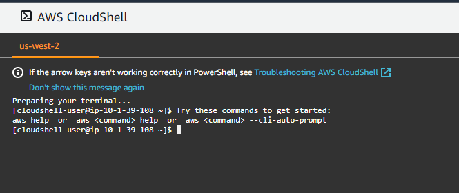

# Lab1: EKS for CNF (Containerized Network Functions) engineer - AWS environment creation

### AWS Region and other notes
* Only use Oregon 'us-west-2' AWS Region. (See console screenshot below)
* EKS cluster is created with Kubernetes 1.21 version with arm64 architecture worker node

## 1. Download/extract CFN templates and lambda_function.zip for this lab accessible locally if not already done
> **_NOTE:_** See additional instructions on Lab GitHub [Front Page](/README.md#download-this-github-as-zip-to-your-local-workstation)

## 2. Open CloudFormation service from AWS console
> **_NOTE:_** please select "Oregon" AWS Region<br>
  * Type "CloudFormation" at search service section and open AWS CloudFormation service.  Tip: Use right mouse button - Open in New tab when opening <br>

  

## 3. Create AWS environment with CloudFormation (CFN)
* In CloudFormation select **Create stack** - *With new resources(standard)*
* Click *Template is ready* (default), "Upload a template file", "Choose file" Select "*aws-immersion-infra.yaml*" file that you have downloaded from GitHub in folder **AWS-Immersion-Day-main\Lab1\template**<br>
  
* Click "Next"
* Fill in following Parameters - **LEAVE OTHERS TO DEFAULTS**
  1. Stack name: **AWS-Infra**
  2. AvailabilityZones: Choose "**us-west-2a**" and "**us-west-2b**"
* Click "Next"
* There is nothing to change in "Configure Stack options" page, so click again "Next" at the bottom
* At Review page - review the changes, go bottom of the page and **mark** checkbox for "I acknowledge that AWS...", and then click "Create stack" 

> Infra CloudFormation stack will build below AWS environment and services 


<br>  

---
> **_NOTE:_** Building the infra (executing AWS CloudFormation) takes a while (~10mins): This is ready when Status becomes "**CREATE_COMPLETE**". Feel free to look around CFN stack and services created (EC2, VPC, EKS...). To see current status and **refresh** the "Events" in CloudFormation console to validate progress
---

<br>

## 4. Open AWS CloudShell from AWS console - after AWS CloudFormation stack "Status" is  **CREATE_COMPLETE**

Open AWS CloudShell from AWS console main page "CloudShell" icon:<br>
 

Close Welcome to AWS CloudShell prompt and check "Do not show again"

AWS CloudShell Prompt:<br>


Export account ID as environment variable. And store to .bash_profile
````bash
export ACCOUNT_ID=$(aws sts get-caller-identity --output text --query Account)
echo "export ACCOUNT_ID=${ACCOUNT_ID}" | tee -a ~/.bash_profile
````

> **_NOTE:_** If you get prompt about "Safe Paste..." just select "Paste" (And select not to show again)

Install kubectl (x86 version)
````bash
curl -o kubectl https://amazon-eks.s3.us-west-2.amazonaws.com/1.21.2/2021-07-05/bin/linux/amd64/kubectl
chmod +x ./kubectl
mkdir -p $HOME/bin && mv ./kubectl $HOME/bin/kubectl
kubectl version --short --client
````

* Verify name of your EKS cluster - and write it down
  *  Use AWS CLI to get EKS cluster name
     ````bash 
     aws eks list-clusters --output text --query clusters
     ````

* Configure .kubeconfig with EKS CLI to access your cluster

  ````bash
  aws eks update-kubeconfig --name=$(aws eks list-clusters --output text --query clusters)
  ````

* Validate that kubectl command works and can connect to your cluster
  ````
  kubectl get svc
  ````
  Example Output:<br>
  

* Verify EKS cluster configuration with AWS CLI
  ````
  aws eks describe-cluster --name=$(aws eks list-clusters --output text --query clusters)
  ````

## 5. Create self-managed Multus ready Node Group(NG) for EKS
Create S3 bucket to store Lambda function:<br>


### Open AWS S3 service and create new S3 bucket (folder/directory) with *"Create bucket"* - orange button 
  * Use "US West (Oregon) us-west-2" as AWS Region
 * Bucket name must be globally unique as example *\<your name\>-\<accountid\>-immersion* ALL small letters. You can get AWS Account ID from top corner of AWS console or AWS CLI in CloudShell
     ````
     aws sts get-caller-identity --output text --query Account
     ````
 * Write bucket name down - you will need it later
 * Leave other settings as defaults - and select "Create Bucket" in bottom of page
 * Click the bucket name you just created and drag & drop "lambda_function.zip" file there (which you can find from Lab1/template directory of this GitHub). Next, click *"Upload"*
   * Validate that you have "lambda_function.zip" file in your S3 bucket
 * Remember to write down bucket name (this is required to fill in CloudFormation)

### Open CloudFormation and deploy node group stack
 * Go to CloudFormation console by selecting CloudFormation from Services drop down or by search menu
    * Select *Create stack*, *With new resources(standard)*
    * Click *Template is ready* (default), "Upload a template file", "Choose file". Select "**amazon-eks-nodegroup-multus.yaml**" file that you have downloaded from GitHub
    
    * Click "Next" 
    * Fill in following Parameters - **LEAVE OTHERS TO DEFAULTS**
      1. Stack name: **eks-workers** 

      2. ClusterName: \<Name-of-YOUR-EKS-cluster\> from *AWS infra stack* - 
        * If you used recommended stack name this is **AWS-Infra-EKS** - validate value from your environment <br>
      
      3. ClusterControlPlaneSecurityGroup: **AWS-Infra-EksControlSecurityGroup-xxxx**
      
      4. VpcId: **vpc-AWS-Infra** (Select one you created with AWS infra stack)
      
      5. PrimarySubnets: **privateAz1-AWS-Infra** 
         * This is for primary K8s networking network - eth0 - choose just **one** from AZ1 
      
      6. MultusSubnets: **multus1Az1-AWS-Infra** and **multus2Az1-AWS-Infra** 
         * Choose **both** subnets from **AZ1**: **MultusSubnet1Az1** and **MultusSubnet2Az1**
      
      7. MultusSecurityGroups: **multus-Sg-AWS-Infra** (Example: **AWS-Infra-MultusSecurityGroup-xxxxxx**)
      
      8. LambdaS3Bucket: The one you created above. Just the name of bucket example: "\<your name\>-\<accountid\>-immersion"
      
      9. LambdaS3Key: **lambda_function.zip** (name of zip file you uploaded to S3 - leave default)<br>
      
    * Validate above changes and press "Next" in bottom of the page

    * There is nothing to specify in "Configure Stack options" page, so please click again "Next" at the bottom

    * At Review page - review the parameters, go bottom of the page and **mark** checkbox for "I acknowledge that AWS...", and then click "Create stack" <br>
    
* Once CloudFormation stack creation is completed, check **Outputs** part in the CFN menu and **copy the full value** of NodeInstanceRole in notepad. <br>


Example: **arn:aws:iam::455332889914:role/eks-workers-NodeInstanceRole-EXAMPLEuseYOURS** - use one from your output<br>

### Edit aws-auth ConfigMap - to enable worker node access to cluster

* Execute following commands on CloudShell<br>
  * Download aws-auth-cm.yaml file at CloudShell - and edit it there:

    ````bash
    curl -o aws-auth-cm.yaml https://s3.us-west-2.amazonaws.com/amazon-eks/cloudformation/2020-10-29/aws-auth-cm.yaml
    ````

  * Edit **aws-auth-cm.yaml** file downloaded using vi/vim or other text editor you prefer. <br> 
Place above copied **FULL *NodeInstanceRole* value** to the place of "*<ARN of instance role (not instance profile)>*" - next apply this through kubectl <br>

  * Example picture with *rolearn:* value updated

    

  * Apply modifications after file is edited:

    ````
    kubectl apply -f aws-auth-cm.yaml
    ````
  * Verify node group is created and visible under your cluster. Also check this in EKS Service in AWS console
     ````
     kubectl get nodes -o wide
     ````
  * Example Output:
    

     Nodes should be visible as STATUS "**Ready**" within ~minute.

If all looks good (kubectl get nodes command shows "Ready" worker node instance, networks are as configured) - you are ready to proceed to [Lab2](https://github.com/TheHannuAWS/AWS-Immersion-Day/tree/main/Lab2)