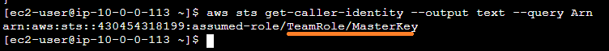
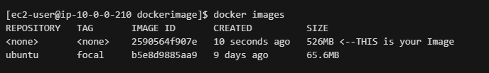

# Lab2: EKS for CNF engineer: Application creation and private ECR repo deployment

## AWS Region and other notes
* ONLY use 'us-west-2' (Oregon) AWS region during these labs
* Use ec2-user on each of the steps unless instructed otherwise

## 1. In this lab we use Bastion Host to build arm64 architecture dummy CNF

* There are multiple methods (SSH - with ee-default-keypari.pem, Instance Connect) to connect to the bastion host - in this lab we will use AWS Systems Manager service
  * Open EC2 service -> Instances (running) -> Select Bastion Host -> "Connect" (right top corner of screen when selecting instance - see picture below) -> In "Session Manager"-tab press Connect to open shell connection. <br>
  

  * Change to ec2-user after login
    ````bash
    sudo su - ec2-user
    ````
    
### Export Credentials
* After you log in to bastion host as **ec2-user** with Systems Manager export AWS credentials in console (AWS_DEFAULT_REGION, AWS_ACCESS_KEY_ID, AWS_SECRET_ACCESS_KEY, AWS_SESSION_TOKEN) copy values for your environment in Event Engine page.

  > **_NOTE:_** Use VALUES you copied/stored earlier in Event Engine and export like *obfuscated* example below

  
    
   
* Validate exported AWS credentials are in use
    
     ````
     aws sts get-caller-identity --output text --query Arn
     ````
  Example output:<br>
  
  
  > **_NOTE:_** Make sure there is "**TeamRole/MasterKey**" assumed-role visible in **Arn** if NOT re-check your export commands on above step
  
  Store exports in .bash_profile so they are preserved on shell log outs:
  ````bash
  echo "export AWS_DEFAULT_REGION=${AWS_DEFAULT_REGION}" | tee -a ~/.bash_profile
  echo "export AWS_ACCESS_KEY_ID=${AWS_ACCESS_KEY_ID}" | tee -a ~/.bash_profile
  echo "export AWS_SECRET_ACCESS_KEY=${AWS_SECRET_ACCESS_KEY}" | tee -a ~/.bash_profile
  echo "export AWS_SESSION_TOKEN=${AWS_SESSION_TOKEN}" | tee -a ~/.bash_profile
  ````

  > **_NOTE:_** This is done for convenience for the labs - not a security best practice

## 2. Install and configure kubectl to Bastion/Build Host

* Download kubectl (arm64) and install it to path in Bastion Host as ec2-user

  ````bash
  curl -o kubectl https://amazon-eks.s3.us-west-2.amazonaws.com/1.21.2/2021-07-05/bin/linux/arm64/kubectl
  chmod +x ./kubectl
  mkdir -p $HOME/bin && cp ./kubectl $HOME/bin/kubectl && export PATH=$PATH:$HOME/bin
  echo 'export PATH=$PATH:$HOME/bin' >> ~/.bashrc
  echo 'source <(kubectl completion bash)' >>~/.bashrc
  kubectl version --short --client
  ````

* Check name of your EKS cluster - and write it down on safe place / notepad
  * You can use CLI to get EKS cluster name
     ````
     aws eks list-clusters --output text --query clusters
     ````
  * You can also see this in CloudFormation "Output" or in EKS console (service search -> EKS)<br>
* Configure kubeconfig with EKS CLI to access your cluster K8s API

  ````
  aws eks update-kubeconfig --name=$(aws eks list-clusters --output text --query clusters)
  ````

* Verify kubectl command works and can connect
  ````
  kubectl get svc
  ````
  Example Output:<br>
  

## 3. Create a Docker Image
* Prepare docker environment (login your bastion host EC2 instance as **ec2-user**)
  
  ````bash
  sudo yum install docker -y
  sudo usermod -aG docker ${USER}
  sudo service docker start
  ````
  After above is executed **LOGOUT** from Bastion host and then log back in as **ec2-user** to set environment right

  > **_NOTE:_** validate that credentials are exported in environment after logging back in as **ec2-user** 

  ````  
  env |grep AWS
  ````
  Output must list AWS_ environment variables and values that we exported.

  Validate kubectl credentials and access works
  ````
  kubectl get svc
  ````

  Validate docker works
  ````bash
  docker
  ````

* Create a directory for Dockerfile
  ````bash
  cd ~
  mkdir dockerimage && cd dockerimage
  ````

* Create a Dockerfile for dummy app
  ````
  cat <<EoF > Dockerfile
  FROM ubuntu:focal
  ENV DEBIAN_FRONTEND noninteractive
  RUN apt-get update && apt-get install -y net-tools iputils-ping iproute2 python python3 pip vim
  RUN pip install boto3 requests
  WORKDIR /
  EoF
  ````
* Build a Docker image
  ```` 
  docker build .
  ````
* Verify Docker image was created. And note down **IMAGE ID** - you need it with ECR
  ````
  docker images 
  ````
  Example output:

  

> **_NOTE:_**  Write down **IMAGE ID** for image you created (above example 2590564f907e) - you need it below

## 4. Create ECR Repository and Upload Image there
Run below commands as ec2-user at Bastion host (where you created a docker image) 

* Create an Elastic Container Repository (ECR) named my-image in us-west-2
   ````
   aws ecr create-repository --repository-name my-image --region us-west-2
   ````

  Store "reposotoryUri" in REPOURI variable for later use:
  ````bash 
  export REPOURI=$(aws ecr describe-repositories --query "repositories[].[repositoryUri]" --output text)
  ````
  Validate that REPOURI value matches ECR URI above
  
  ````bash
  echo $REPOURI
  ````

* Login to ECR:
    ````
    aws ecr get-login-password --region us-west-2 | docker login --username AWS --password-stdin ${REPOURI}
    ````
*  Tag image:

   > **_NOTE:_** Replace below \<IMAGE ID\> you wrote down from above "docker images" command before executing

    ````
    docker tag <IMAGE ID> ${REPOURI}:latest
    ````
* Validate tag was successful:
    ````
    docker images
    ````

*  Push Image to ECR:
    ````
    docker push ${REPOURI}:latest
    ````
  
 Optional: Validate image is visible in ECR repository on AWS console

## 5. Create Multus App using uploaded Docker image from the ECR

* Create a new directory at your bastion host (under /home/ec2-user/)
  ````
  cd ~
  mkdir k8s-environment && cd k8s-environment
  ````
* Install multus CNI (This uses us-west-2 as default image location - below is for arm64 architecture).
   ````
   kubectl apply -f https://raw.githubusercontent.com/aws/amazon-vpc-cni-k8s/master/config/multus/v3.7.2-eksbuild.2/aws-k8s-multus.yaml
   ````

* Validate that demonset started the kube-multus-xxxxx PoD(s):
  ````
  kubectl get pod -A
  ````

* Create networkAttachmentDefinition (multus-ipvlan.yaml) with below command

````yaml
cat <<EoF > multus-ipvlan.yaml
apiVersion: "k8s.cni.cncf.io/v1"
kind: NetworkAttachmentDefinition
metadata:
  name: ipvlan-conf
spec:
  config: '{
      "cniVersion": "0.3.0",
      "type": "ipvlan",
      "master": "eth1",
      "mode": "l2",
      "ipam": {
        "type": "host-local",
        "subnet": "10.0.4.0/24",
        "rangeStart": "10.0.4.70",
        "rangeEnd": "10.0.4.80",
        "gateway": "10.0.4.1"
      }
    }'
EoF
````
  Apply networkAttachmentDefinition configuration to K8s
  ````
  kubectl apply -f multus-ipvlan.yaml
  ````

* Deploy your docker using above network attachment. Create a file named, app-ipvlan.yaml

````yaml
 cat <<EoF > app-ipvlan.yaml
 apiVersion: v1
 kind: Pod
 metadata:
   name: samplepod
   annotations:
     k8s.v1.cni.cncf.io/networks: ipvlan-conf
 spec:
   containers:
   - name: samplepod
     command: ["/bin/bash", "-c", "trap : TERM INT; sleep infinity & wait"]
     image: ${REPOURI}:latest
EoF
````
> **_NOTE:_** Validate file has ECR image as "**image:**" value before applying configuration!

Create Pod
````bash
kubectl apply -f app-ipvlan.yaml
````

Validate Pod creation
````bash
kubectl describe pod samplepod
````
* In case there are errors on image pull - take second look on ECR/docker steps above

* Verify your Pod has 2 interfaces (eth0 for default K8s networking and net1 for Multus interface (10.0.4.0/24) - open shell session

  ````
  kubectl exec -it samplepod -- /bin/bash
  ````  
* Run ifconfig in *samplepod* as root (not on bastion host) to validate you see two interfaces:<br>
  ````
  ifconfig
  ````
  Example output:<br>
  

## Publish samplepod IP to AWS VPC level (as a Secondary private IPv4 address) 

Multus pod is using ipvlan CNI, which means that the MAC-address of the pod remains same as the master interface. In this case AWS VPC will **NOT** be aware of the assumed IP address of the pod, since the IP allocations to these pods hasn’t happened via VPC. VPC is only aware of the IP addresses allocated on the ENI on EC2 worker nodes. 

### Validate secondary IP is not visible on EC2 level 

Go look Secondary private IPv4 addresses on EC2 console:

* Open EC2 service -> Instances (running) -> Select EKS Worker Node (AWS-Infra-EKS...) -> Look "Networking" tab "Secondary private IPv4 addresses". See picture below.

See picture: [EC2-no-secondary-IP](images/ec2-no-secondaryIP.png) for additional details

### Update Multus pod IP on VPC/EC2 level

> **_NOTE:_** To make samplepod IP routable and visible in VPC network perform following commands **root** in **samplepod** Pod (NOT on bastion host)

Create Python script ipUpdate.py with following command in **samplepod** (not on bastion host):

````python
cat <<EoF > ipUpdate.py
import requests
import boto3, json
import sys
from requests.packages.urllib3 import Retry

ec2_client = boto3.client('ec2', region_name='us-west-2')

def assign_ip():
    instance_id = get_instance_id()
    subnet_cidr = "10.0.4.0/24"

    response = ec2_client.describe_subnets(
        Filters=[
            {
                'Name': 'cidr-block',
                'Values': [
                    subnet_cidr,
                ]
            },
        ]
    )

    for i in response['Subnets']:
        subnet_id = i['SubnetId']
        break

    response = ec2_client.describe_network_interfaces(
        Filters=[
            {
                'Name': 'subnet-id',
                'Values': [
                    subnet_id,
                ]
            },
            {
                'Name': 'attachment.instance-id',
                'Values': [
                    instance_id,
                ]
            }
        ]
    )

    for j in response['NetworkInterfaces']:
        network_interface_id = j['NetworkInterfaceId']
        break

    response = ec2_client.assign_private_ip_addresses(
        AllowReassignment=True,
        NetworkInterfaceId=network_interface_id,
        PrivateIpAddresses=[
            "10.0.4.70",
        ]
    )

def get_instance_id():
    instance_identity_url = "http://169.254.169.254/latest/dynamic/instance-identity/document"
    session = requests.Session()
    retries = Retry(total=3, backoff_factor=0.3)
    metadata_adapter = requests.adapters.HTTPAdapter(max_retries=retries)
    session.mount("http://169.254.169.254/", metadata_adapter)
    try:
        r = requests.get(instance_identity_url, timeout=(2, 5))
    except (requests.exceptions.ConnectTimeout, requests.exceptions.ConnectionError) as err:
        print("Connection to AWS EC2 Metadata timed out: " + str(err.__class__.__name__))
        print("Is this an EC2 instance? Is the AWS metadata endpoint blocked? (http://169.254.169.254/)")
        sys.exit(1)
    response_json = r.json()
    instanceid = response_json.get("instanceId")
    return(instanceid)

assign_ip()
EoF
````
> **_NOTE:_** This is hard coded sample that works for samplepod we build - not suitable as a generic reference

Execute script (as root on samplepod):
````bash
python3 ipUpdate.py
````

### Validate that 10.0.4.70 is visible as secondary IP on EKS EC2 worker node

* Open EC2 service -> Instances (running) -> Select EKS Worker Node (AWS-Infra-EKS...) -> Look "Networking" tab "Secondary private IPv4 addresses".

See image for details: [EC2 secondary IP present](images/ec2-secondaryIP-visible.png) for additional details

---

**CONGRATULATIONS!** You have now successfully performed all exercises on this workshop!<br>

---

## 5. What next? 

* Look around in the environment - EKS, EC2, Lambda, EventBridge - how things relate ?
* Create Additional NetworkAttachmentDefinition and other samplepod (in different network) and try to enable ping between the hots (remember to publish secondary private IP's)
* Validate alternate connectivity methods - example tunnel SSH session through Session Manager [SSH-SSM](https://docs.aws.amazon.com/systems-manager/latest/userguide/session-manager-getting-started-enable-ssh-connections.html)
* Update some parameter in CFN - what happens ? How to add second worker node to EKS ? How to change worker node size bigger ?
* See official AWS Multus Guide: https://github.com/aws-samples/eks-install-guide-for-multus (Includes latest updates)
* Look additional EKS labs in [eksworksop.com](https://www.eksworkshop.com/)
  * Especially: IAM/RBAC/IRSA related and how to work those with EKS
* As discussed Multus pods are using ipvlan CNI, which means that the mac-address of the pod remains same as the master interface. In this case AWS VPC will not be aware of the assumed IP address of the pod, since the IP allocations to these pods hasn’t happened via VPC. VPC is only aware of the IP addresses allocated on the ENI on EC2 worker nodes. To make these IPs automatically routable in VPC network, please refer to [**Automated Multus pod IP management on EKS**](https://github.com/aws-samples/eks-automated-ipmgmt-multus-pods) how to automate the pod IP assignment seamlessly, without any change in application code.
* You can also walk through [this blog post contents](https://aws.amazon.com/blogs/opensource/open-source-mobile-core-network-implementation-on-amazon-elastic-kubernetes-service/). You already have done the most of parts of setup process guided in the blog (Note that we used arm64 here) - in blog will build your own functional Open Source 4G EPC Core on EKS environment within 45 min following steps similar to this course. 

* **Go Build** your CNF apps with AWS!

## 6. Clean up labs
1. Go to CloudFormation and "Delete" "eks-workers" stack you created 
2. After above is deleted also "Delete" the "AWS-Infra" stack
3. Delete and empty also S3 bucket your created