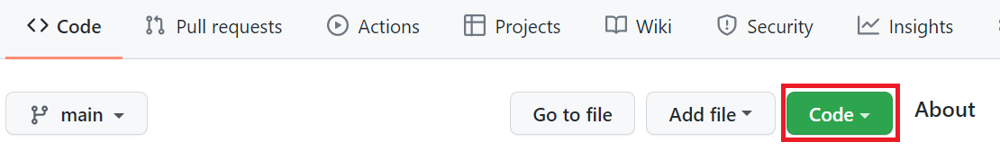
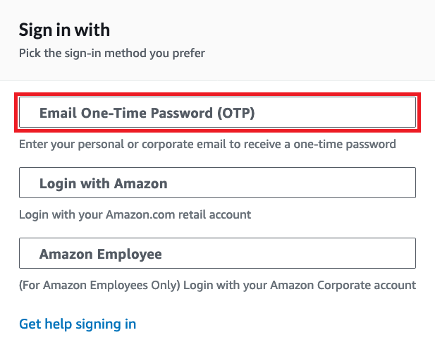
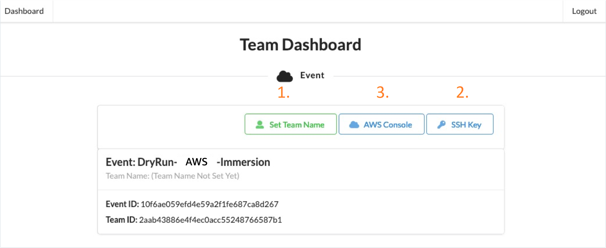

# AWS-Immersion-Day for Telco CNF/K8s engineers (dev/test) 

In this workshop we deploy AWS EKS (Elastic Kubernetes Service) and related AWS services with AWS [Graviton2](https://aws.amazon.com/ec2/graviton/) (arm64) based worker nodes supporting Multus - and build and deploy dummy CNF/application from AWS ECR Repository. 
See [AWS EKS Multus Setup Guide](https://github.com/aws-samples/eks-install-guide-for-multus) for additional info about Multus and EKS.  

## AWS Region
* ONLY use 'us-west-2' (Oregon) Region during these labs.

## Download this GitHub as zip -file to your local workstation and extract the contents
For the download, please select "Code" on the top left corner of menu, and then click green "Code" menu and then select "**Download Zip**" file. 

> **_NOTE_** Unzip this on local folder that is accessible - you will need files when progressing with lab's 

## Log in to AWS Event Engine
* Open [Event Engine](https://dashboard.eventengine.run/dashboard)
* Type in *Event Hash* that is shared by your instructor - "Accept Terms & Login"
* Use OTP authentication Sing in with your company email address 
   
Log in with OTP (One-Time Password) received in e-mail and perform following steps: 

1. "Set Team Name"
    * Use your name as team name      
2. Store "SSH key" 
    * Download **ee-default-keypair** to your PC - also copy key material to notepad
3. Open "AWS Console"
    * Copy credentials (export AWS_DEFAULT_REGION=..) in notepad
    * Click "Open AWS Console" ("Switch to the new Console Home" if prompted)
---
> **_NOTE:_** You have now access to AWS account for this workshop and can proceed to Lab's
---

## What we will learn today ? 
* **[Lab1](https://github.com/TheHannuAWS/AWS-Immersion-Day/tree/main/Lab1)**: EKS environment creation (VPC, Subnets, Bastion Host, EKS cluster, Multus-ready worker node) for CNF deployment

* **[Lab2](https://github.com/TheHannuAWS/AWS-Immersion-Day/tree/main/Lab2)**: Create dummy Pod Application (CNF) using Multus - build image and deploy from Amazon ECR
